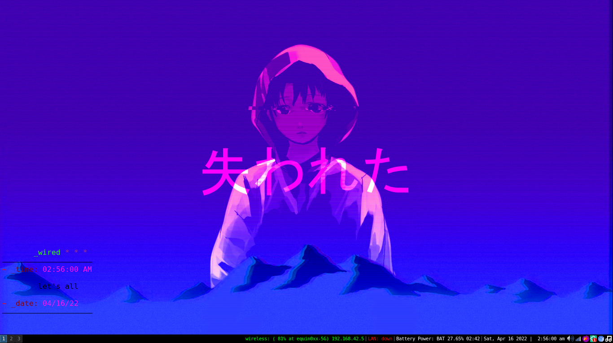

# wired window manager
=====

### Welcome to the Wired

**wiredWM** is rav3ndust's personal fork of i3, which is a tiling window manager for X11.

###### let's all love lain

=====

## minimal and lightweight 

 
###### minimal desktop and keyboard-driven for quick efficiency. clickable icons are located at the bottom of the status bar for common tasks- for those unfortunate occasions where you have to reach for the mouse

Easy to use and easily extensible. Takes up very little of precious system resources, and gives you a minimal but efficient keyboard-driven environment, so you can focus less on messing around with bells and whistles found on prominent desktop environments and focus more on the task at hand. It *is* a tiling window manager, and these sorts of WMs are well-loved for how efficient and extensible they can be. 

**Clickable launchers for:**

- Sound control (handled through `volumeicon-alsa`).
- Screenshot utility (handles via `flameshot`.)
- Network/Wi-Fi manager (handles via `nm-applet`.)

=====

## more resources for your stuff

###### browse the web and run all of your favorite applications in a minimal environment 

Just open up the **nightshade launcher** by pressing *crtl+d* - that launches a custom **dmenu** script, and you can search for and launch your applications with ease. Think of it as your miniature Start panel.

For a general list of applications, you can also press *ctrl+Shift+a* and scroll through to select one. Anything that has a desktop entry will appear here. 

=====

## organize your windows with ease

###### automate the organization of the windows on your screen

A bunch of floating windows can become difficult to manage in the middle of a workflow - which is another reason a tiling window manager can really come in handy. Being built on top of the much-loved **i3**, **wiredWM** allows you to easily tile or float your windows with a quick keyboard shortcut. 

=====

### custom stuff

**wiredWM** also contains: 

- *nightshader*, a custom **dmenu** for running commands and launching applications.
- scripts for lock screen with password via **i3lock-fancy**
- my own custom scripts built on top of [suckless's](https://suckless.org) **surf** browser.
- a custom **conky** config
- various other assorted things
- custom keyboard shortcuts for some of the scripts we've built in

### more 

For more information about i3, please see [the project's website](https://i3wm.org/) and [online documentation](https://i3wm.org/docs/). I'll be updating docs for this fork soon. 

You're of course more than free to contribute to my fork, but if you want to check out more information about contributing to the OG i3, please see [CONTRIBUTING.md](.github/CONTRIBUTING.md). 

If you like **wiredWM** and feel some burning desire to help fund it, please direct your contributions towards the parent project, **i3**. WIthout it, this project would not be able to exist! 

*close the world, enter the nExt* ;)
